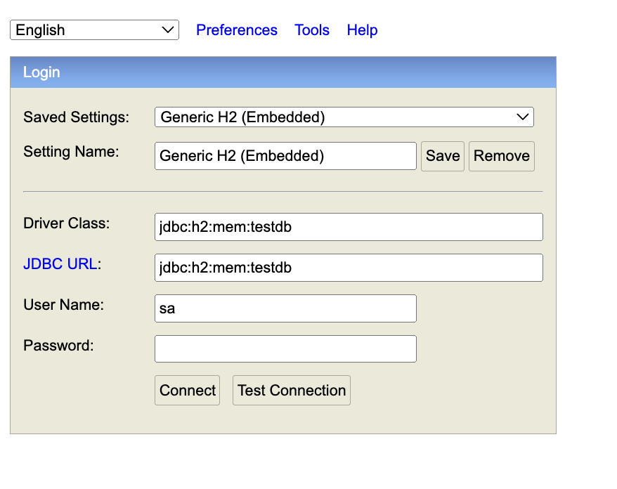
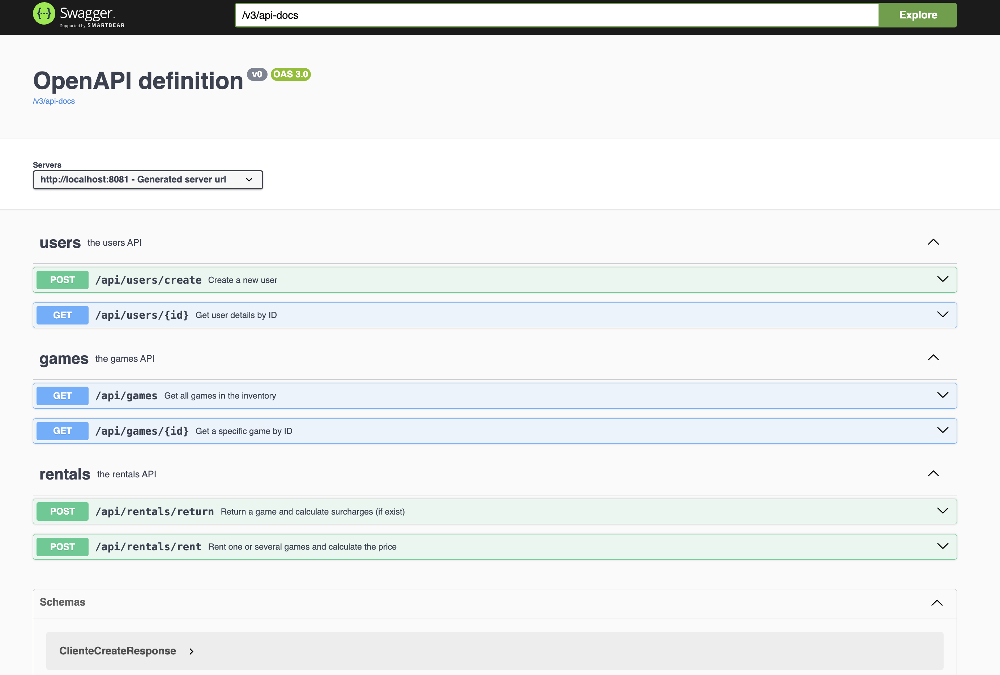
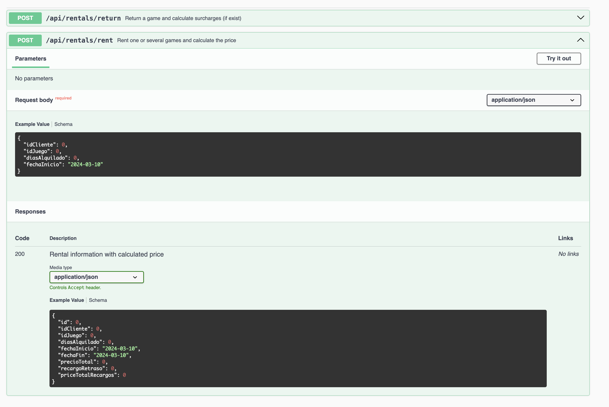
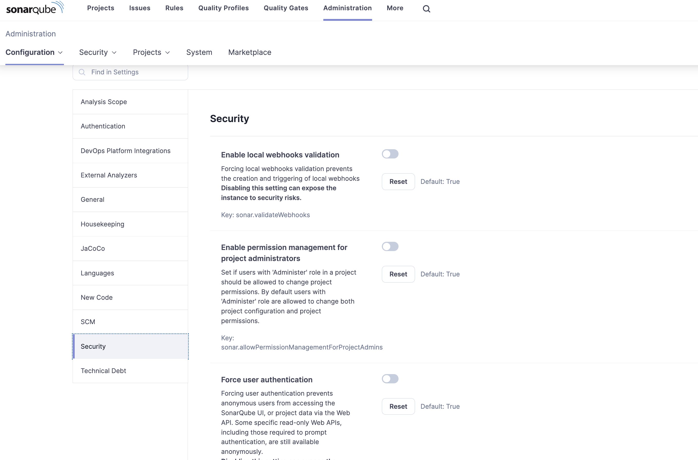
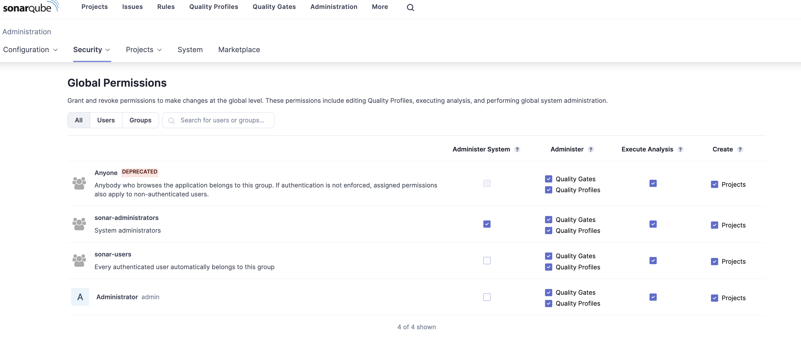
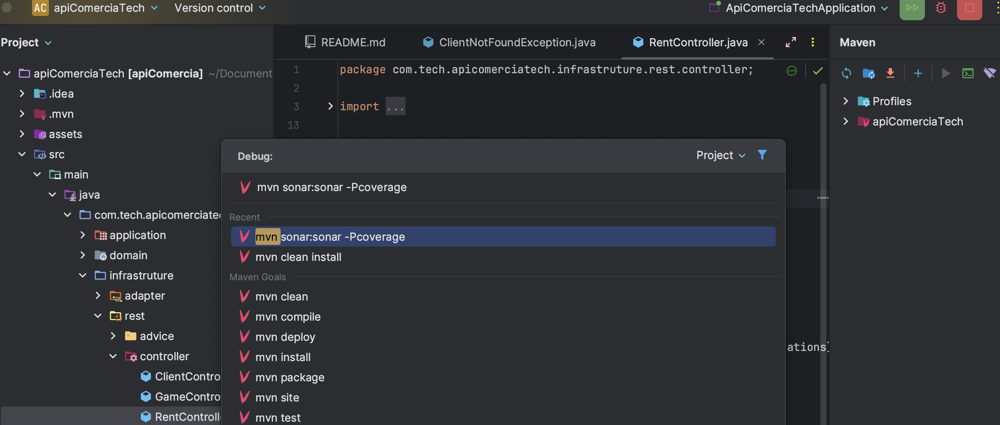
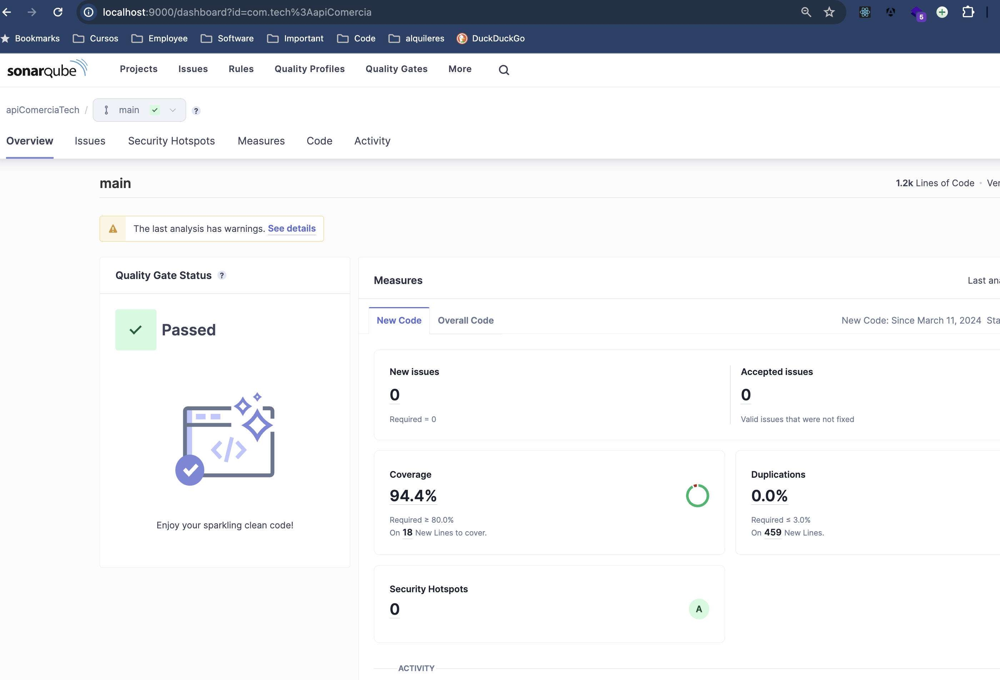
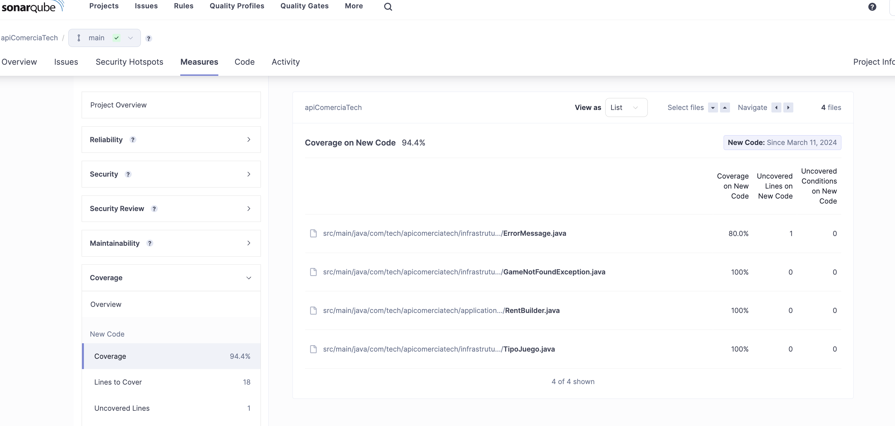
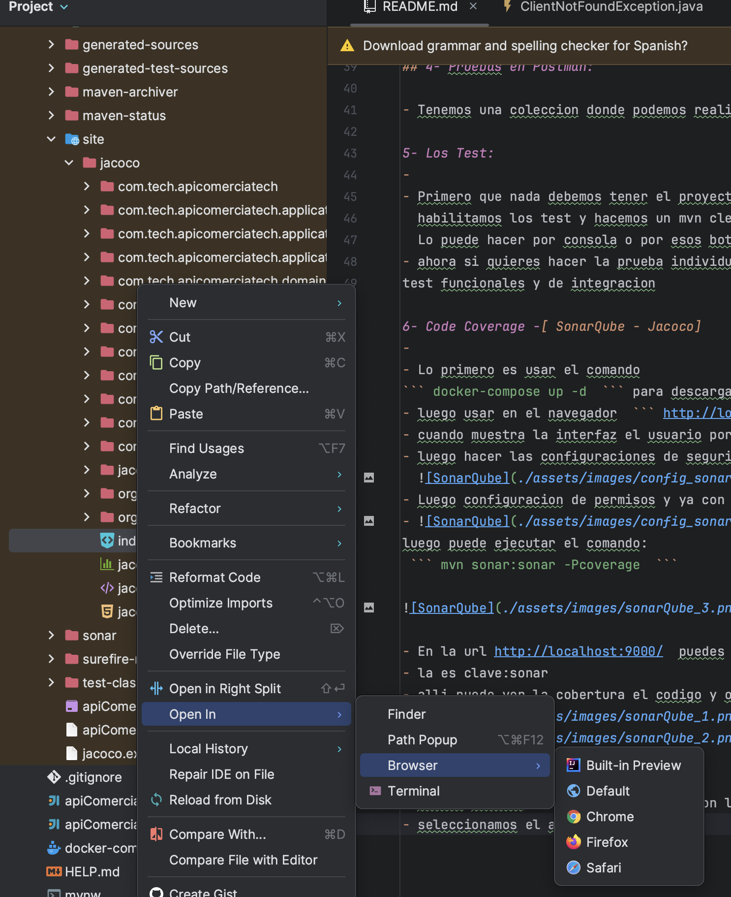

## Detalles del proyecto

Para el proyecto, inicialmente realicé un análisis exhaustivo de los datos proporcionados, centrado principalmente en la información relacionada con los juegos y los precios asociados a cada tipo de juego, así como en los detalles sobre el cobro de recargos en caso de extensiones de alquiler.

Comencé mi trabajo desarrollando el contrato en OpenAPI, lo que me permitió definir los campos necesarios y los endpoints requeridos para la API. Una vez completado este paso, procedí a la implementación de los entity y la creación de los mappers correspondientes.

Posteriormente, continué el desarrollo del resto del código utilizando una arquitectura hexagonal, que facilitó la modularización y la separación de las responsabilidades en diferentes capas de la aplicación.

Es importante destacar que, si bien los datos de usuarios y juegos inicialmente se podían insertar a través de un script de base de datos (data.sql), decidí agregar la funcionalidad para crear al menos usuarios directamente a través de la API. Además, proporcioné endpoints para visualizar el detalle de un usuario, así como para obtener una lista de los juegos asociados a dicho usuario, junto con la posibilidad de ver tanto la lista completa de juegos como los detalles específicos de cada uno de ellos.


1- Descargar dependecias:
-
Usar Intellij IDEA Community edition https://www.jetbrains.com/idea/download

Para este pequeño proyecto se esta usando maven como manejador de dependencias
  por lo que una vez descargado el proyecto debes usar el comando:
  
  ``` mvn clean install ```

2- Correr el proyecto:
-
 para ello vas a la clase ApiComerciaTechApplication y le das a las flechas de  ``` run ```

Esto Creara la tabla y base de datos h2
Puedes acceder a la base de datos por el navegador en la url
 
  ``` http://localhost:8081/h2-console ```

   
 ```
- Driver Class:  jdbc:h2:mem:testdb
- Usuario: sa
- password:
 ```

3- Prueba de funcionalidad del proyecto:
-
Puedes hacer las consultas por la url:
  ``` http://localhost:8081/swagger-ui/index.html ```  
  donde haras uso de Swagger UI una herramienta de openApi para hacer pruebas:
   
ejemplo del codigo json para crear un usuario:
 ```
  {
  "name": "Marcos"
  }
  ```
Muestra ejemplo del Json de entrada y de salida:
  


## 4- Pruebas en Postman:

Tenemos una coleccion donde podemos realizar las deferentes pruebas y consultas, se subira en este proyecto  

5- Los Test:
-
Primero que nada debemos tener el proyecto corriendo, entrar al boton de maven del lado izquierdo del IDEA
  habilitamos los test y hacemos un mvn clean install
  Lo puede hacer por consola o por esos botones de consola que aparecen

Ahora si quieres hacer la prueba individualmente de cada uno de los test puedes ingresar al proyecto, donde estan test unitario, 
test funcionales y de integracion

6- Code Coverage -[ SonarQube - Jacoco]
-
Lo primero es usar el comando 
``` docker-compose up -d  ``` para descargar las imagenes de docker y crear los contenedores
luego usar en el navegador  ``` http://localhost:9000  ``` eso ingresa a la interfaz de sonarQube

Cuando muestra la interfaz el usuario por defecto es  ``` admin  ``` y el password  ``` admin  ``` y luego te pide que ingrese de nuevo la clave para cambiarla por la que desees

Luego hacer las configuraciones de seguridad,deshabilitamos todas.
  
Luego configuracion de permisos y ya con eso podemos usar sonarqube.
  
luego puede ejecutar el comando:
 ``` mvn sonar:sonar -Pcoverage  ```


 ```
- En la url http://localhost:9000/  
- usuarios=  admin
- password=  admin

luego te pide cambio de clave por la que quieras.
 ```
alli puede ver la cobertura el codigo y otras cosas:



### Jacoco 
Cuando hacemos el mvn clean install con los test habilitados, esto nos crea una carpeta donde se encuentra jacoco:

Seleccionamos el archivo index.html y abrimos en el navegador
